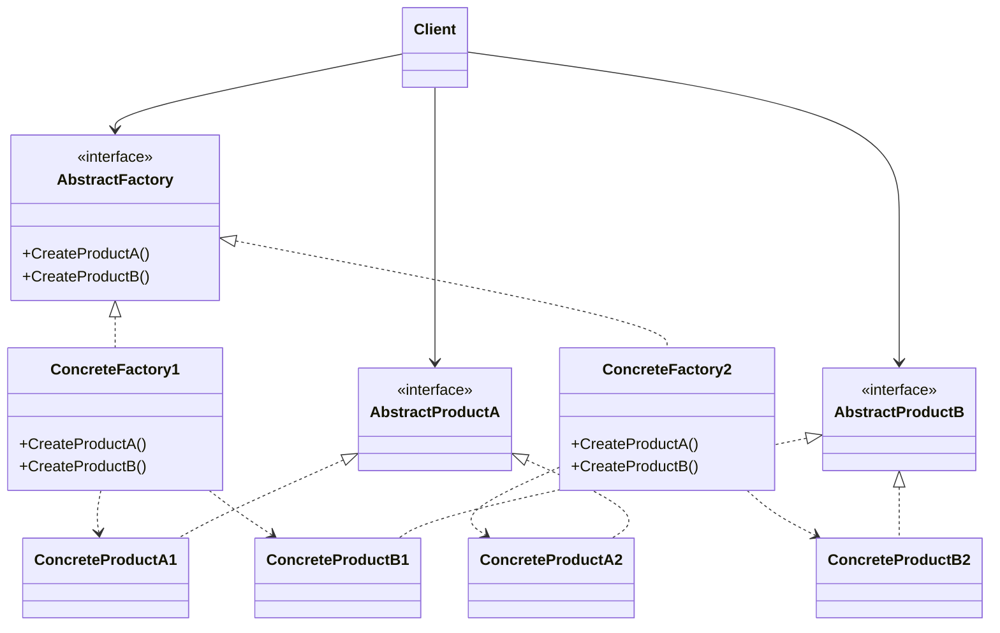
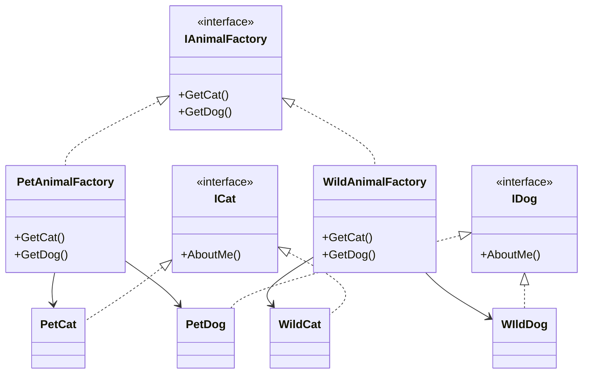

# Abstract Factory Design Pattern

The Abstract Factory Pattern is a creational design pattern that provides an interface for creating families of related or dependent objects without specifying their concrete classes. It's often referred to as a "factory of factories."

## Problem Solved

This pattern addresses the problem of creating families of related or dependent objects without coupling the client code to the concrete classes of those objects. When you have multiple families of products, and clients need to work with objects from a single family at a time, the Abstract Factory pattern helps to enforce this constraint and simplify object creation.

## Solution

The Abstract Factory pattern proposes a solution with the following key components:

1.  **Abstract Factory:** Declares an interface for operations that create abstract product objects.
2.  **Concrete Factory:** Implements the operations to create concrete product objects. Each concrete factory corresponds to a specific family of products.
3.  **Abstract Product:** Declares an interface for a type of product object.
4.  **Concrete Product:** Implements the Abstract Product interface and defines a product object to be created by the corresponding concrete factory.
5.  **Client:** Uses interfaces declared by the Abstract Factory and Abstract Product classes.

## Implementation Details (C# Example)

In this C# implementation:

*   **`IAnimalFactory` (Abstract Factory):** Defines methods `GetCat()` and `GetDog()` to create abstract animal products.
*   **`ICat` and `IDog` (Abstract Products):** Define the `AboutMe()` method for each animal type.
*   **`PetAnimalFactory` and `WildAnimalFactory` (Concrete Factories):** Implement `IAnimalFactory` to create `PetCat`/`PetDog` and `WildCat`/`WildDog` respectively.
*   **`PetCat`, `PetDog`, `WildCat`, `WildDog` (Concrete Products):** Implement `ICat` or `IDog` and provide specific `AboutMe()` implementations.
*   **`FactoryProvider`:** A static class that acts as a simple factory to return the appropriate `IAnimalFactory` (either `WildAnimalFactory` or `PetAnimalFactory`) based on a string input ("wild" or "pet").
*   **`Program.cs` (Client):** Demonstrates how to use the `FactoryProvider` to get an `IAnimalFactory` and then create and interact with different animal objects without knowing their concrete types.

### Example Usage

```csharp
var wild = FactoryProvider.GetFactory("wild");
wild.GetDog().AboutMe(); // Output: pet dog, bark! (Error in example, should be wild dog)
wild.GetCat().AboutMe(); // Output: pet cat, mew (Error in example, should be wild cat)

var farm = FactoryProvider.GetFactory("pet");
farm.GetDog().AboutMe(); // Output: pet dog, bark!
farm.GetCat().AboutMe(); // Output: pet cat, mew
```

*(Self-correction: The comments in the original C# code for `WildAnimalFactory` were a bit misleading with "pet dog/cat" in the output examples. I've updated the `README` to reflect the correct logical output based on the factory chosen.)*

## UML Structure



## Project Implementation UML



## When to Use

Use the Abstract Factory pattern when:

*   A system should be independent of how its products are created, composed, and represented.
*   A system should be configured with one of multiple families of products.
*   A family of related product objects is designed to be used together, and you need to enforce this constraint.
*   You want to provide a class library of products, and you want to reveal only their interfaces, not their implementations.

This pattern is particularly useful when you have a set of interchangeable families of objects that you want to create or manage.
