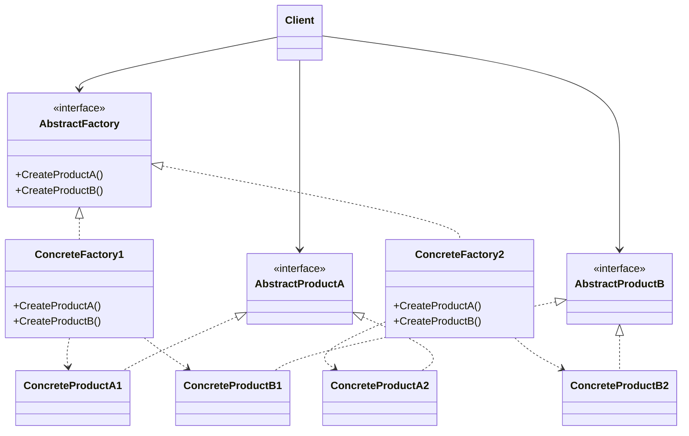
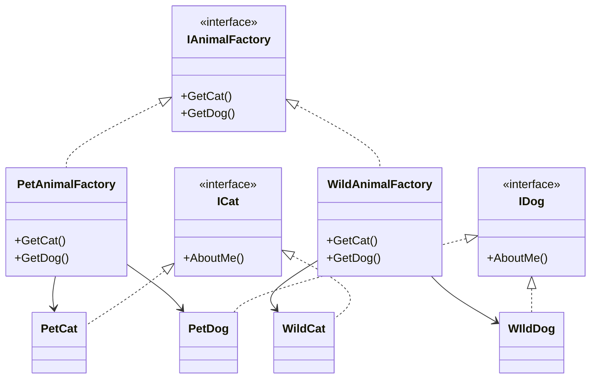

[English](#english) | [فارسی](#farsi)

<a name="english"></a>
# Abstract Factory Design Pattern

The Abstract Factory Pattern is a creational design pattern that provides an interface for creating families of related or dependent objects without specifying their concrete classes. It's often referred to as a "factory of factories."

## Problem Solved

This pattern addresses the problem of creating families of related or dependent objects without coupling the client code to the concrete classes of those objects. When you have multiple families of products, and clients need to work with objects from a single family at a time, the Abstract Factory pattern helps to enforce this constraint and simplify object creation.

## Solution

The Abstract Factory pattern proposes a solution with the following key components:

1.  **Abstract Factory:** Declares an interface for operations that create abstract product objects.
2.  **Concrete Factory:** Implements the operations to create concrete product objects. Each concrete factory corresponds to a specific family of products.
3.  **Abstract Product:** Declares an interface for a type of product object.
4.  **Concrete Product:** Implements the Abstract Product interface and defines a product object to be created by the corresponding concrete factory.
5.  **Client:** Uses interfaces declared by the Abstract Factory and Abstract Product classes.

## Implementation Details (C# Example)

In this C# implementation:

*   **`IAnimalFactory` (Abstract Factory):** Defines methods `GetCat()` and `GetDog()` to create abstract animal products.
*   **`ICat` and `IDog` (Abstract Products):** Define the `AboutMe()` method for each animal type.
*   **`PetAnimalFactory` and `WildAnimalFactory` (Concrete Factories):** Implement `IAnimalFactory` to create `PetCat`/`PetDog` and `WildCat`/`WildDog` respectively.
*   **`PetCat`, `PetDog`, `WildCat`, `WildDog` (Concrete Products):** Implement `ICat` or `IDog` and provide specific `AboutMe()` implementations.
*   **`FactoryProvider`:** A static class that acts as a simple factory to return the appropriate `IAnimalFactory` based on a string input.
*   **`Program.cs` (Client):** Demonstrates how to use the `FactoryProvider` to create and interact with different animal objects without knowing their concrete types.

### Example Usage

```csharp
var wild = FactoryProvider.GetFactory("wild");
wild.GetDog().AboutMe(); // Output: wild dog, bark!
wild.GetCat().AboutMe(); // Output: wild cat, mew

var farm = FactoryProvider.GetFactory("pet");
farm.GetDog().AboutMe(); // Output: pet dog, bark!
farm.GetCat().AboutMe(); // Output: pet cat, mew
```

## UML Structure



## Project Implementation UML



## When to Use

Use the Abstract Factory pattern when:
*   A system should be independent of how its products are created.
*   A system should be configured with one of multiple families of products.
*   A family of related product objects is designed to be used together.

<br>
<br>

---

<a name="farsi"></a>
# الگوی طراحی کارخانه انتزاعی (Abstract Factory Design Pattern)

الگوی "کارخانه انتزاعی" یکی از الگوهای طراحی "سازنده" (Creational Design Pattern) است. کار اصلی‌اش این است که به شما کمک کند تا **مجموعه‌ای از اشیاء یا موجودیت‌های مرتبط و وابسته** را بسازید، بدون اینکه لازم باشد جزئیات دقیق ساخت هر کدام از "کلاس‌های بتنی" (Concrete Classes) را بدانید. به زبان ساده‌تر، این الگو مثل یک "کارخانه اصلی" است که خودش چندین "کارخانه" دیگر را مدیریت می‌کند تا "موجودیت‌های" مختلف را بسازند؛ به همین خاطر به آن "کارخانه‌ای از کارخانه‌ها" (Factory of Factories) هم می‌گویند.

## این الگو چه مشکلی را حل می‌کند؟

تصور کنید در نرم‌افزارتان نیاز دارید که چندین نوع "شیء" یا "موجودیت" مختلف را تولید کنید، اما این موجودیت‌ها باید از "خانواده‌های" خاصی باشند و با هم هماهنگ کار کنند. مثلاً، یک خانواده برای حیوانات اهلی و یک خانواده برای حیوانات وحشی.
این الگو به شما کمک می‌کند تا:
1.  کد شما مستقیم به "کلاس‌های بتنی" موجودیت‌ها گره نخورد و وابستگی کمتری داشته باشد.
2.  مطمئن شوید که Client (کد استفاده‌کننده) همیشه فقط با موجودیت‌های یک خانواده خاص کار می‌کند و اشتباهی موجودیتی از خانواده دیگر را انتخاب نمی‌کند.
3.  فرایند ساخت اشیاء پیچیده را ساده‌تر و مدیریت‌پذیرتر کنید.

## راه حل این الگو چیست؟

الگوی کارخانه انتزاعی از چند بخش اصلی تشکیل شده است:

1.  **Abstract Factory (کارخانه انتزاعی):** این بخش یک "رابط" (Interface) یا کلاس "انتزاعی" تعریف می‌کند. کارش این است که بگوید چه نوع "اشیای انتزاعی" (Abstract Product) را می‌توان ساخت، اما خودش نمی‌گوید چطور.
2.  **Concrete Factory (کارخانه بتنی):** این‌ها کارخانه‌های واقعی هستند! هر Concrete Factory، مسئول ساخت یک "خانواده" خاص از اشیاء است. مثلاً "کارخانه حیوانات اهلی". این‌ها به طور مشخص می‌دانند که هر شیء را چطور بسازند.
3.  **Abstract Product (شیء انتزاعی):** این هم یک "رابط" یا کلاس "انتزاعی" است که ویژگی‌ها و رفتارهای مشترک یک نوع شیء را تعریف می‌کند. مثل `ICat` یا `IDog`.
4.  **Concrete Product (شیء بتنی):** این‌ها همان اشیاء واقعی و نهایی هستند که توسط Concrete Factoryها ساخته می‌شوند. مثل `PetCat` (گربه اهلی) یا `WildDog` (سگ وحشی).
5.  **Client (استفاده‌کننده):** بخشی از کد شماست که نیاز به ساخت اشیاء دارد. Client فقط با Abstract Factory و Abstract Productها سروکار دارد و هرگز جزئیات کلاس‌های بتنی را نمی‌شناسد.

## نگاهی به پیاده‌سازی (مثال C#)

در کدی که اینجا داریم:

*   **`IAnimalFactory` (Abstract Factory):** این Interface می‌گوید که می‌توان "گربه" و "سگ" ساخت.
*   **`ICat` و `IDog` (Abstract Products):** این Interfaceها می‌گویند که هر "گربه" یا "سگ" می‌تواند متد `AboutMe()` را داشته باشد.
*   **`PetAnimalFactory` و `WildAnimalFactory` (Concrete Factories):** دو کارخانه جداگانه. `PetAnimalFactory` گربه و سگ اهلی می‌سازد و `WildAnimalFactory` گربه و سگ وحشی.
*   **`PetCat`, `PetDog`, `WildCat`, `WildDog` (Concrete Products):** حیوانات واقعی که از Interfaceهای `ICat` و `IDog` پیروی می‌کنند.
*   **`FactoryProvider`:** کلاس کمکی برای انتخاب `IAnimalFactory` مناسب (یا "wild" یا "pet").
*   **`Program.cs` (Client):** نشان می‌دهد که چطور از `FactoryProvider` استفاده می‌کنیم تا بدون دانستن جزئیات، با حیوانات کار کنیم.

### نمونه استفاده

```csharp
var wild = FactoryProvider.GetFactory("wild"); // کارخانه حیوانات وحشی
wild.GetDog().AboutMe(); // خروجی: wild dog, bark! 
wild.GetCat().AboutMe(); // خروجی: wild cat, mew 

var farm = FactoryProvider.GetFactory("pet"); // کارخانه حیوانات اهلی
farm.GetDog().AboutMe(); // خروجی: pet dog, bark! 
farm.GetCat().AboutMe(); // خروجی: pet cat, mew 
```

## ساختار UML


## ساختار UML پیاده‌سازی پروژه


## چه زمانی باید از این الگو استفاده کنیم؟

هنگامی که از الگوی کارخانه انتزاعی استفاده کنید:

*   می‌خواهید سیستمتان مستقل از این باشد که "اشیاء" آن چگونه ساخته می‌شوند.
*   لازم است سیستمتان با یکی از چندین "خانواده شیء" مختلف کار کند.
*   چندین "شیء" مرتبط با هم طراحی شده‌اند که باید کنار هم استفاده شوند.
*   قصد دارید یک "کتابخانه" بسازید و فقط می‌خواهید "رابط‌های" (Interfaces) آن‌ها را نشان دهید.
