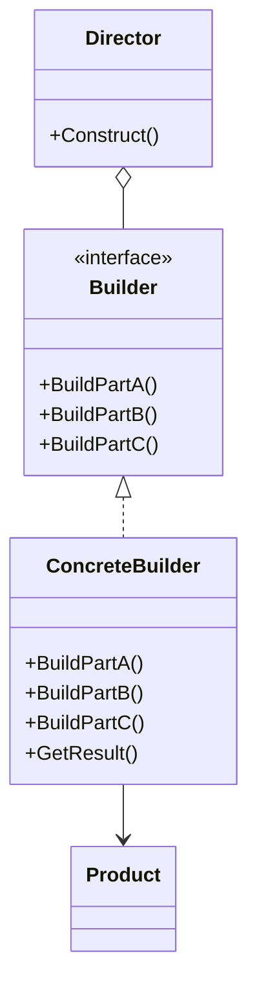
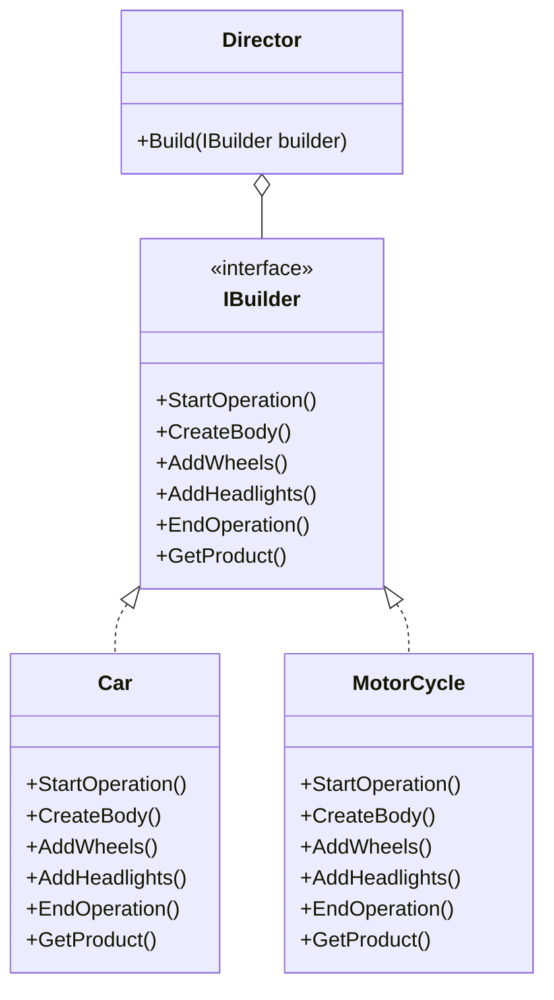

[English](#english) | [فارسی](#farsi)

<a name="english"></a>
# Builder Design Pattern

The Builder pattern is a creational design pattern that focuses on constructing a complex object step by step. It separates the construction of a complex object from its representation, so the same construction process can create different representations.

## Problem Solved

This pattern is useful for creating complex objects that have multiple parts and a complex construction process. It addresses the issue of having a "telescoping constructor" (a constructor with many parameters, leading to many overloaded constructors) or a large, unwieldy constructor that makes the object difficult to create and maintain. The Builder pattern allows you to create different representations of an object using the same construction process.

## Solution

The Builder pattern involves four key participants:

1.  **Builder (IBuilder):** Declares an abstract interface for creating parts of a Product object. It defines a set of methods for building the different components of the complex object.
2.  **Concrete Builder (Car, MotorCycle in Implementation #1; Car in Implementation #2):** Implements the Builder interface to construct and assemble parts of the product. It provides specific implementations for the building steps.
3.  **Director (Director in Implementation #1; Client in Implementation #2):** Constructs an object using the Builder interface. It knows the sequence of building steps and directs the builder to produce a specific configuration of the product.
4.  **Product (Product):** Represents the complex object under construction. It typically includes methods to add or show its parts.

## Implementation Details (C# Example)

This solution provides two implementations of the Builder pattern.

### Implementation #1 (Traditional Builder Pattern)

*   **`IBuilder`:** Defines the building steps (`StartOperation`, `CreateBody`, `AddWheels`, `AddHeadlights`, `EndOperation`) and a method to `GetProduct()`. It also includes comments explaining that the builder assembles different parts.
*   **`Director`:** Contains a `Build` method that takes an `IBuilder` and orchestrates the construction process by calling the builder's methods in a predefined sequence.
*   **`Car` and `MotorCycle` (Concrete Builders):** Implement `IBuilder` to construct specific types of vehicles. Each builder maintains its own `Product` instance and adds parts according to its specific construction logic.
*   **`Product`:** A simple class to hold a list of parts and display them.

### Example Usage for Implementation #1 (commented out in Program.cs)

```csharp
// var director = new Director();
// var car = new Car("BMW");
// director.Build(car);
// car.GetProduct().ShowDetails();

// var motor = new MotorCycle("MOTOR#1");
// director.Build(motor);
// motor.GetProduct().ShowDetails();
```

### Implementation #2 (Fluent Builder with Method Chaining)

This implementation modifies the `IBuilder` to return `IBuilder` itself for most methods, allowing for method chaining, making the client code more readable and concise. In this scenario, the client effectively acts as the director.

*   **`IBuilder`:** Methods like `StartOperation`, `AddWheels`, `AddHeadlights`, `BuildBody`, `EndOperation` all return `IBuilder`, enabling chaining. A `Construct()` method is used to finalize and return the `Product`.
*   **`Car` (Concrete Builder):** Implements the chained `IBuilder` methods. Each method performs its building step and returns `this` (the current builder instance).
*   **`Product`:** Similar to Implementation #1, but with an `AddPart` method and `Show` method.

### Example Usage for Implementation #2

```csharp
var customCar = new BuilderPattern_SecondImplementation.Car("FORD")
    .StartOperation("just started making a new ford, wish me luck!")
    .BuildBody("steel")
    .AddWHeels(4)
    .AddHeadlights(2)
    .EndOperation("just made my new ford!")
    .Construct();

customCar.Show();

// Not-so-smart way (without chaining, showing method calls separately):
var anotherOne = new BuilderPattern_SecondImplementation.Car("MERCEDES BENZ");
anotherOne.StartOperation();
anotherOne.BuildBody();
anotherOne.AddHeadlights(2);
anotherOne.AddWHeels(4);
anotherOne.EndOperation("ENJOY!");
anotherOne.Construct().Show();
```

## UML Structure



## When to Use

Use the Builder pattern when:

*   The algorithm for creating a complex object should be independent of the parts that make up the object and how they're assembled.
*   The construction process needs to allow different representations of the object that's constructed.
*   You want to avoid a constructor with a large number of parameters (telescoping constructor).
*   You need to construct complex objects step-by-step or in varying sequences.

## Project Implementation UML



<br>
<br>

---

<a name="farsi"></a>
# الگوی طراحی Builder (Builder Design Pattern)

الگوی "Builder" یکی دیگر از الگوهای طراحی "سازنده" (Creational Design Pattern) است که بر **ساخت مرحله به مرحله یک شیء پیچیده** تمرکز دارد. این الگو فرایند ساخت یک شیء پیچیده را از "نمایش" (Representation) آن جدا می‌کند، به طوری که همان فرایند ساخت می‌تواند برای ایجاد "نمایش‌های" مختلفی از آن شیء استفاده شود.

## این الگو چه مشکلی را حل می‌کند؟

این الگو برای ساخت "اشیای پیچیده‌ای" که از بخش‌های زیادی تشکیل شده‌اند و فرایند ساخت پیچیده‌ای دارند، بسیار مفید است. مشکلاتی مانند "سازنده‌های تلسکوپی" (Telescoping Constructor) – یعنی سازنده‌هایی با تعداد زیادی پارامتر که منجر به داشتن چندین سازنده (Overloaded Constructor) می‌شوند – یا یک سازنده بزرگ و دشوار را حل می‌کند که باعث می‌شود ایجاد و نگهداری شیء سخت شود. الگوی Builder به شما این امکان را می‌دهد که "نمایش‌های" مختلفی از یک شیء را با استفاده از یک فرایند ساخت یکسان ایجاد کنید.

## راه حل این الگو چیست؟

الگوی Builder شامل چهار بخش اصلی است:

1.  **Builder (سازنده - IBuilder):** یک رابط "انتزاعی" (Abstract Interface) برای ایجاد بخش‌های یک شیء "Product" تعریف می‌کند. این رابط مجموعه‌ای از متدها را برای ساخت اجزای مختلف شیء پیچیده تعریف می‌کند.
2.  **Concrete Builder (سازنده بتنی - Car, MotorCycle در پیاده‌سازی شماره ۱؛ Car در پیاده‌سازی شماره ۲):** رابط Builder را پیاده‌سازی می‌کند تا بخش‌های شیء "Product" را بسازد و مونتاژ کند. این بخش پیاده‌سازی‌های خاصی برای مراحل ساخت فراهم می‌کند.
3.  **Director (مدیر - Director در پیاده‌سازی شماره ۱؛ Client در پیاده‌سازی شماره ۲):** یک شیء را با استفاده از رابط Builder می‌سازد. Director توالی مراحل ساخت را می‌داند و Builder را هدایت می‌کند تا پیکربندی خاصی از "Product" را تولید کند.
4.  **Product (شیء نهایی):** شیء پیچیده‌ای را که در حال ساخت است، نمایش می‌دهد. معمولاً شامل متدهایی برای افزودن یا نمایش بخش‌های آن است.

## جزئیات پیاده‌سازی (مثال C#)

این راه‌حل دو پیاده‌سازی از الگوی Builder را ارائه می‌دهد.

### پیاده‌سازی شماره ۱ (الگوی Builder سنتی)

*   **`IBuilder`:** مراحل ساخت (`StartOperation`, `CreateBody`, `AddWheels`, `AddHeadlights`, `EndOperation`) و یک متد برای `GetProduct()` را تعریف می‌کند. همچنین شامل توضیحاتی است که Builder چگونه بخش‌های مختلف را مونتاژ می‌کند.
*   **`Director`:** شامل یک متد `Build` است که یک `IBuilder` را می‌گیرد و فرایند ساخت را با فراخوانی متدهای Builder به ترتیب از پیش تعیین‌شده هماهنگ می‌کند.
*   **`Car` و `MotorCycle` (Concrete Builders):** رابط `IBuilder` را برای ساخت انواع خاصی از وسایل نقلیه پیاده‌سازی می‌کنند. هر Builder نمونه `Product` خود را نگهداری کرده و بخش‌ها را مطابق با منطق ساخت خاص خود اضافه می‌کند.
*   **`Product`:** یک کلاس ساده برای نگهداری لیست قطعات و نمایش آن‌ها.

### نمونه استفاده برای پیاده‌سازی شماره ۱ (در Program.cs کامنت شده است)

```csharp
// var director = new Director();
// var car = new Car("BMW");
// director.Build(car);
// car.GetProduct().ShowDetails();

// var motor = new MotorCycle("MOTOR#1");
// director.Build(motor);
// motor.GetProduct().ShowDetails();
```

### پیاده‌سازی شماره ۲ (Fluent Builder با Method Chaining)

این پیاده‌سازی `IBuilder` را به گونه‌ای تغییر می‌دهد که بیشتر متدها خود `IBuilder` را برمی‌گردانند و امکان "Method Chaining" را فراهم می‌کنند. این کار باعث می‌شود کد Client خواناتر و مختصرتر شود. در این سناریو، Client به طور مؤثر نقش Director را ایفا می‌کند.

*   **`IBuilder`:** متدهایی مانند `StartOperation`, `AddWheels`, `AddHeadlights`, `BuildBody`, `EndOperation` همگی `IBuilder` را برمی‌گردانند و امکان Chaining را فراهم می‌کنند. متد `Construct()` برای نهایی کردن و برگرداندن شیء `Product` استفاده می‌شود.
*   **`Car` (Concrete Builder):** متدهای زنجیره‌ای `IBuilder` را پیاده‌سازی می‌کند. هر متد مرحله ساخت خود را انجام داده و `this` (نمونه فعلی Builder) را برمی‌گرداند.
*   **`Product`:** مشابه پیاده‌سازی شماره ۱، اما با متد `AddPart` و `Show`.

### نمونه استفاده برای پیاده‌سازی شماره ۲

```csharp
var customCar = new BuilderPattern_SecondImplementation.Car("FORD")
    .StartOperation("just started making a new ford, wish me luck!")
    .BuildBody("steel")
    .AddWHeels(4)
    .AddHeadlights(2)
    .EndOperation("just made my new ford!")
    .Construct();

customCar.Show();

// روش نه چندان هوشمندانه (بدون Chaining، فراخوانی متدها به صورت جداگانه):
var anotherOne = new BuilderPattern_SecondImplementation.Car("MERCEDES BENZ");
anotherOne.StartOperation();
anotherOne.BuildBody();
anotherOne.AddHeadlights(2);
anotherOne.AddWHeels(4);
anotherOne.EndOperation("ENJOY!");
anotherOne.Construct().Show();
```

## ساختار UML


## چه زمانی باید از این الگو استفاده کنیم؟

هنگامی که از الگوی Builder استفاده کنید:

*   الگوریتم ساخت یک شیء پیچیده باید مستقل از بخش‌هایی باشد که شیء را تشکیل می‌دهند و نحوه مونتاژ آن‌ها.
*   فرایند ساخت نیاز به امکان ایجاد "نمایش‌های" مختلفی از شیء ساخته شده داشته باشد.
*   می‌خواهید از داشتن یک سازنده با تعداد زیادی پارامتر ("سازنده تلسکوپی") جلوگیری کنید.
*   نیاز به ساخت اشیاء پیچیده مرحله به مرحله یا در توالی‌های متغیر دارید.

## ساختار UML پیاده‌سازی پروژه


