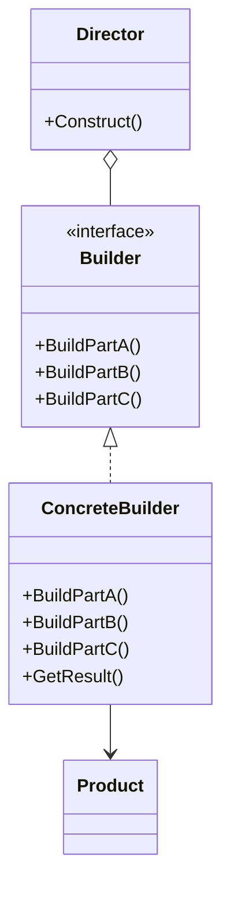
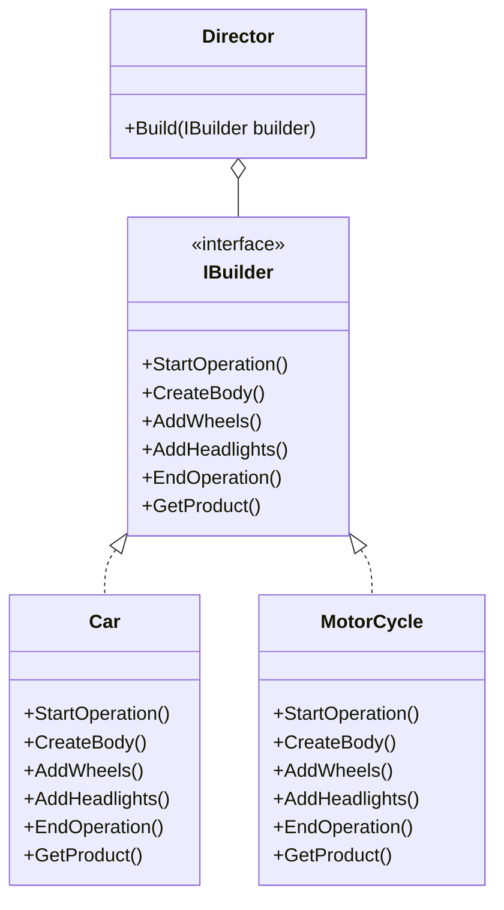

# Builder Design Pattern

The Builder pattern is a creational design pattern that focuses on constructing a complex object step by step. It separates the construction of a complex object from its representation, so the same construction process can create different representations.

## Problem Solved

This pattern is useful for creating complex objects that have multiple parts and a complex construction process. It addresses the issue of having a "telescoping constructor" (a constructor with many parameters, leading to many overloaded constructors) or a large, unwieldy constructor that makes the object difficult to create and maintain. The Builder pattern allows you to create different representations of an object using the same construction process.

## Solution

The Builder pattern involves four key participants:

1.  **Builder (IBuilder):** Declares an abstract interface for creating parts of a Product object. It defines a set of methods for building the different components of the complex object.
2.  **Concrete Builder (Car, MotorCycle in Implementation #1; Car in Implementation #2):** Implements the Builder interface to construct and assemble parts of the product. It provides specific implementations for the building steps.
3.  **Director (Director in Implementation #1; Client in Implementation #2):** Constructs an object using the Builder interface. It knows the sequence of building steps and directs the builder to produce a specific configuration of the product.
4.  **Product (Product):** Represents the complex object under construction. It typically includes methods to add or show its parts.

## Implementation Details (C# Example)

This solution provides two implementations of the Builder pattern.

### Implementation #1 (Traditional Builder Pattern)

*   **`IBuilder`:** Defines the building steps (`StartOperation`, `CreateBody`, `AddWheels`, `AddHeadlights`, `EndOperation`) and a method to `GetProduct()`. It also includes comments explaining that the builder assembles different parts.
*   **`Director`:** Contains a `Build` method that takes an `IBuilder` and orchestrates the construction process by calling the builder's methods in a predefined sequence.
*   **`Car` and `MotorCycle` (Concrete Builders):** Implement `IBuilder` to construct specific types of vehicles. Each builder maintains its own `Product` instance and adds parts according to its specific construction logic.
*   **`Product`:** A simple class to hold a list of parts and display them.

### Example Usage for Implementation #1 (commented out in Program.cs)

```csharp
// var director = new Director();
// var car = new Car("BMW");
// director.Build(car);
// car.GetProduct().ShowDetails();

// var motor = new MotorCycle("MOTOR#1");
// director.Build(motor);
// motor.GetProduct().ShowDetails();
```

### Implementation #2 (Fluent Builder with Method Chaining)

This implementation modifies the `IBuilder` to return `IBuilder` itself for most methods, allowing for method chaining, making the client code more readable and concise. In this scenario, the client effectively acts as the director.

*   **`IBuilder`:** Methods like `StartOperation`, `AddWheels`, `AddHeadlights`, `BuildBody`, `EndOperation` all return `IBuilder`, enabling chaining. A `Construct()` method is used to finalize and return the `Product`.
*   **`Car` (Concrete Builder):** Implements the chained `IBuilder` methods. Each method performs its building step and returns `this` (the current builder instance).
*   **`Product`:** Similar to Implementation #1, but with an `AddPart` method and `Show` method.

### Example Usage for Implementation #2

```csharp
var customCar = new BuilderPattern_SecondImplementation.Car("FORD")
    .StartOperation("just started making a new ford, wish me luck!")
    .BuildBody("steel")
    .AddWHeels(4)
    .AddHeadlights(2)
    .EndOperation("just made my new ford!")
    .Construct();

customCar.Show();

// Not-so-smart way (without chaining, showing method calls separately):
var anotherOne = new BuilderPattern_SecondImplementation.Car("MERCEDES BENZ");
anotherOne.StartOperation();
anotherOne.BuildBody();
anotherOne.AddHeadlights(2);
anotherOne.AddWHeels(4);
anotherOne.EndOperation("ENJOY!");
anotherOne.Construct().Show();
```

## UML Structure



## When to Use

Use the Builder pattern when:

*   The algorithm for creating a complex object should be independent of the parts that make up the object and how they're assembled.
*   The construction process needs to allow different representations of the object that's constructed.
*   You want to avoid a constructor with a large number of parameters (telescoping constructor).
*   You need to construct complex objects step-by-step or in varying sequences.

## Project Implementation UML


