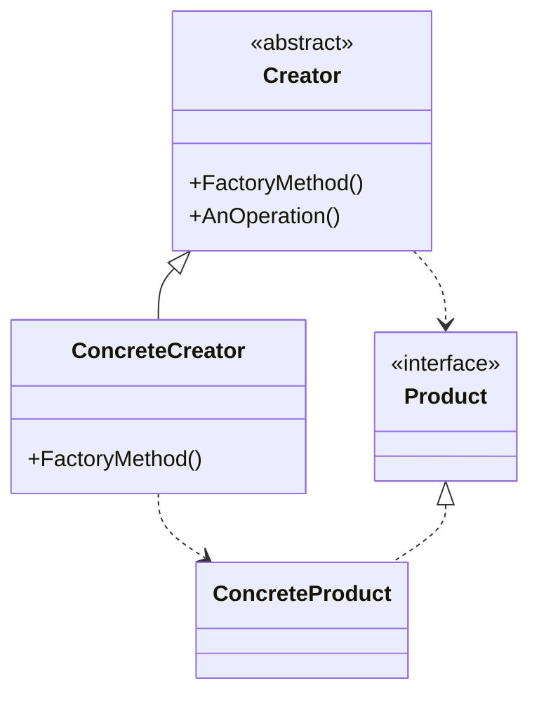
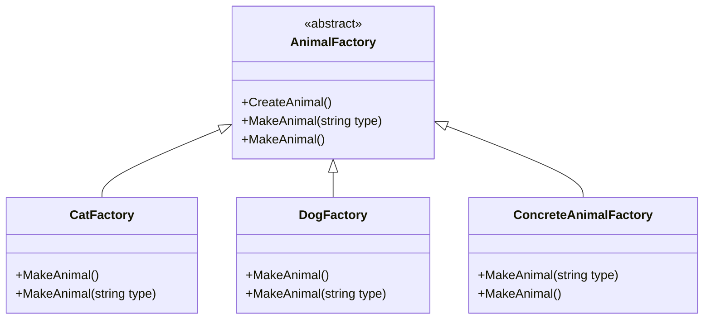

# Factory Method Design Pattern

The Factory Method Pattern is a creational design pattern that defines an interface for creating an object, but lets subclasses decide which class to instantiate. It defers instantiation to subclasses.

## Problem Solved

This pattern addresses the problem of creating objects without specifying the exact class of object that will be created. It's particularly useful when a class cannot anticipate the class of objects it needs to create, or when a class wants its subclasses to specify the objects to be created. It promotes loose coupling between the creator and the product classes.

## Solution

The Factory Method pattern typically involves the following participants:

1.  **Product (IAnimal):** Defines the interface of objects the factory method creates.
2.  **Concrete Product (Cat, Dog):** Implements the Product interface.
3.  **Creator (AnimalFactory):** Declares the factory method, which returns an object of type Product. The Creator may also define a default implementation of the factory method that returns a default Concrete Product object. It may call the factory method to create a Product object.
4.  **Concrete Creator (CatFactory, DogFactory, ConcreteAnimalFactory):** Overrides the factory method to return an instance of a Concrete Product.

## Implementation Details (C# Example)

In this C# implementation, there are a couple of approaches shown:

### Approach 1: Dedicated Concrete Factories

*   **`IAnimal` (Product):** An interface with a `Talk()` method.
*   **`Cat` and `Dog` (Concrete Products):** Implement `IAnimal` with specific `Talk()` implementations.
*   **`AnimalFactory` (Creator):** An abstract class that defines an abstract `MakeAnimal()` factory method. It also has a `CreateAnimal()` method that demonstrates how a creator might use its factory method.
*   **`CatFactory` and `DogFactory` (Concrete Creators):** Inherit from `AnimalFactory` and override `MakeAnimal()` to return a `Cat` or `Dog` instance, respectively.

### Approach 2: Single Concrete Factory with Type Parameter

*   **`ConcreteAnimalFactory` (Concrete Creator):** This factory also inherits from `AnimalFactory`. Its `MakeAnimal(string type)` method uses a `switch` expression to return an `IAnimal` instance based on the provided `type` string (e.g., "Dog" or "Cat"). This centralizes the decision of which concrete product to create within one factory class, but still defers the actual instantiation to different branches of logic within that factory method.

### Simple Factory Pattern (Included in subfolder)

There is also a `SimplefactoryPattern` subfolder that demonstrates a simpler approach, sometimes referred to as a Simple Factory or Static Factory. This is not a true GoF Factory Method but is a common pattern for centralizing object creation:

*   **`IAnimal` (SimplefactoryPattern/IAnimal.cs):** Interface for animals.
*   **`Dog` (SimplefactoryPattern/Dog.cs) and `Tiger` (SimplefactoryPattern/Tiger.cs):** Concrete animal implementations.
*   **`Simplefactory` (SimplefactoryPattern/Simplefactory.cs):** A static class with a static method `CreateAnimal(string type)` that returns an animal based on the type. This is a simpler way to encapsulate object creation, but it doesn't use inheritance to defer instantiation to subclasses.

### Example Usage (`Program.cs`):

```csharp
// Using ConcreteAnimalFactory with type parameter
var concreteFactory = new ConcreteAnimalFactory();
concreteFactory.MakeAnimal("Dog"); // Output: I'm a dog, I bark!
concreteFactory.MakeAnimal("Cat"); // Output: I'm just a cat, I don't talk much, but I can meow.

// Using dedicated CatFactory
var catFactory = new CatFactory();
catFactory.MakeAnimal().Talk(); // Output: I'm just a cat, I don't talk much, but I can meow.

// Using dedicated DogFactory
var dogFactory = new DogFactory();
dogFactory.MakeAnimal().Talk(); // Output: I'm a dog, I bark!
```

## UML Structure



## Project Implementation UML



## When to Use

Use the Factory Method pattern when:

*   A class can't anticipate the class of objects it needs to create.
*   A class wants its subclasses to specify the objects it creates.
*   Classes delegate responsibility to one of several helper subclasses, and you want to localize the knowledge of which helper subclass is the delegate.

This pattern is very common in framework development where the framework needs to standardize the creation of components but leaves the specific implementation details to the application developers using the framework.
