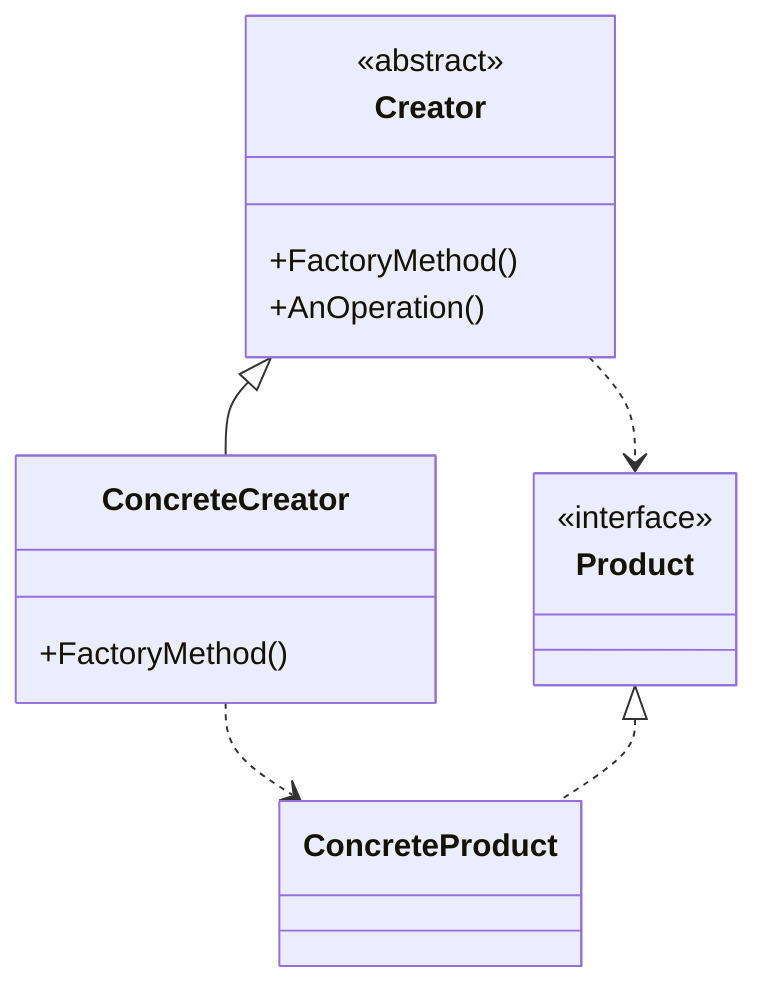
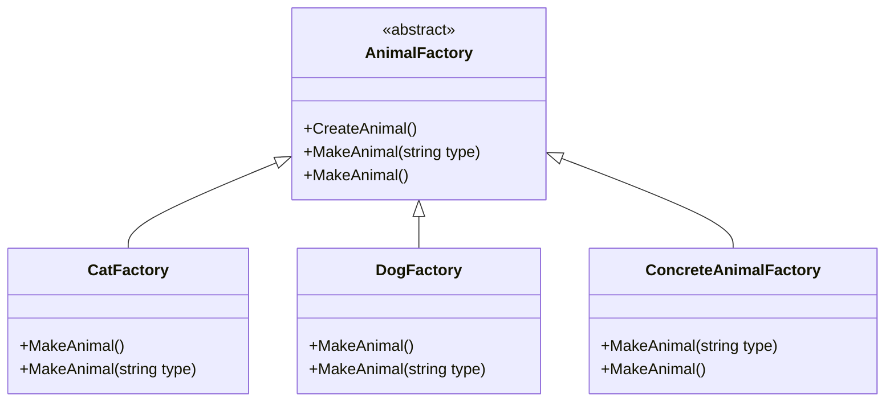

[English](#english) | [فارسی](#farsi)

<a name="english"></a>
# Factory Method Design Pattern

The Factory Method Pattern is a creational design pattern that defines an interface for creating an object, but lets subclasses decide which class to instantiate. It defers instantiation to subclasses.

## Problem Solved

This pattern addresses the problem of creating objects without specifying the exact class of object that will be created. It's particularly useful when a class cannot anticipate the class of objects it needs to create, or when a class wants its subclasses to specify the objects to be created. It promotes loose coupling between the creator and the product classes.

## Solution

The Factory Method pattern typically involves the following participants:

1.  **Product (IAnimal):** Defines the interface of objects the factory method creates.
2.  **Concrete Product (Cat, Dog):** Implements the Product interface.
3.  **Creator (AnimalFactory):** Declares the factory method, which returns an object of type Product. The Creator may also define a default implementation of the factory method that returns a default Concrete Product object. It may call the factory method to create a Product object.
4.  **Concrete Creator (CatFactory, DogFactory, ConcreteAnimalFactory):** Overrides the factory method to return an instance of a Concrete Product.

## Implementation Details (C# Example)

In this C# implementation, there are a couple of approaches shown:

### Approach 1: Dedicated Concrete Factories

*   **`IAnimal` (Product):** An interface with a `Talk()` method.
*   **`Cat` and `Dog` (Concrete Products):** Implement `IAnimal` with specific `Talk()` implementations.
*   **`AnimalFactory` (Creator):** An abstract class that defines an abstract `MakeAnimal()` factory method. It also has a `CreateAnimal()` method that demonstrates how a creator might use its factory method.
*   **`CatFactory` and `DogFactory` (Concrete Creators):** Inherit from `AnimalFactory` and override `MakeAnimal()` to return a `Cat` or `Dog` instance, respectively.

### Approach 2: Single Concrete Factory with Type Parameter

*   **`ConcreteAnimalFactory` (Concrete Creator):** This factory also inherits from `AnimalFactory`. Its `MakeAnimal(string type)` method uses a `switch` expression to return an `IAnimal` instance based on the provided `type` string (e.g., "Dog" or "Cat"). This centralizes the decision of which concrete product to create within one factory class, but still defers the actual instantiation to different branches of logic within that factory method.

### Simple Factory Pattern (Included in subfolder)

There is also a `SimplefactoryPattern` subfolder that demonstrates a simpler approach, sometimes referred to as a Simple Factory or Static Factory. This is not a true GoF Factory Method but is a common pattern for centralizing object creation:

*   **`IAnimal` (SimplefactoryPattern/IAnimal.cs):** Interface for animals.
*   **`Dog` (SimplefactoryPattern/Dog.cs) and `Tiger` (SimplefactoryPattern/Tiger.cs):** Concrete animal implementations.
*   **`Simplefactory` (SimplefactoryPattern/Simplefactory.cs):** A static class with a static method `CreateAnimal(string type)` that returns an animal based on the type. This is a simpler way to encapsulate object creation, but it doesn't use inheritance to defer instantiation to subclasses.

### Example Usage (`Program.cs`):

```csharp
// Using ConcreteAnimalFactory with type parameter
var concreteFactory = new ConcreteAnimalFactory();
concreteFactory.MakeAnimal("Dog"); // Output: I'm a dog, I bark!
concreteFactory.MakeAnimal("Cat"); // Output: I'm just a cat, I don't talk much, but I can meow.

// Using dedicated CatFactory
var catFactory = new CatFactory();
catFactory.MakeAnimal().Talk(); // Output: I'm just a cat, I don't talk much, but I can meow.

// Using dedicated DogFactory
var dogFactory = new DogFactory();
dogFactory.MakeAnimal().Talk(); // Output: I'm a dog, I bark!
```

## UML Structure



## Project Implementation UML



## When to Use

Use the Factory Method pattern when:

*   A class can't anticipate the class of objects it needs to create.
*   A class wants its subclasses to specify the objects it creates.
*   Classes delegate responsibility to one of several helper subclasses, and you want to localize the knowledge of which helper subclass is the delegate.

This pattern is very common in framework development where the framework needs to standardize the creation of components but leaves the specific implementation details to the application developers using the framework.

<br>
<br>

---

<a name="farsi"></a>
# الگوی طراحی متد کارخانه (Factory Method Design Pattern)

الگوی "متد کارخانه" یک الگوی طراحی "سازنده" (Creational Design Pattern) است که یک رابط برای ایجاد یک شیء تعریف می‌کند، اما به زیرکلاس‌ها اجازه می‌دهد تا تصمیم بگیرند کدام کلاس را نمونه‌سازی (Instantiate) کنند. این الگو مسئولیت نمونه‌سازی را به زیرکلاس‌ها محول می‌کند.

## این الگو چه مشکلی را حل می‌کند؟

این الگو به مشکل ایجاد اشیاء بدون مشخص کردن دقیق کلاس شیئی که قرار است ایجاد شود، می‌پردازد. این الگو به خصوص زمانی مفید است که یک کلاس نمی‌تواند کلاس اشیایی را که نیاز به ایجاد آن‌ها دارد، پیش‌بینی کند، یا زمانی که یک کلاس می‌خواهد زیرکلاس‌هایش اشیاء مورد نظر را مشخص کنند. این الگو باعث کاهش وابستگی (Loose Coupling) بین کلاس Creator و کلاس‌های Product می‌شود.

## راه حل این الگو چیست؟

الگوی متد کارخانه معمولاً شامل شرکت‌کنندگان زیر است:

1.  **Product (شیء - IAnimal):** رابطی برای اشیایی که متد کارخانه ایجاد می‌کند، تعریف می‌کند.
2.  **Concrete Product (شیء بتنی - Cat, Dog):** رابط Product را پیاده‌سازی می‌کند.
3.  **Creator (سازنده):** متد کارخانه را اعلان می‌کند که یک شیء از نوع Product برمی‌گرداند. Creator ممکن است یک پیاده‌سازی پیش‌فرض از متد کارخانه را نیز تعریف کند که یک شیء Concrete Product پیش‌فرض را برمی‌گرداند. این بخش ممکن است متد کارخانه را برای ایجاد یک شیء Product فراخوانی کند.
4.  **Concrete Creator (سازنده بتنی - CatFactory, DogFactory, ConcreteAnimalFactory):** متد کارخانه را Override می‌کند تا یک نمونه از یک Concrete Product را برگرداند.

## جزئیات پیاده‌سازی (مثال C#)

در این پیاده‌سازی C#، چند رویکرد نشان داده شده است:

### رویکرد ۱: کارخانه‌های بتنی اختصاصی

*   **`IAnimal` (Product):** یک رابط با متد `Talk()`.
*   **`Cat` و `Dog` (Concrete Products):** رابط `IAnimal` را با پیاده‌سازی‌های خاص `Talk()` پیاده‌سازی می‌کنند.
*   **`AnimalFactory` (Creator):** یک کلاس انتزاعی است که یک متد کارخانه انتزاعی `MakeAnimal()` را تعریف می‌کند. همچنین دارای یک متد `CreateAnimal()` است که نحوه استفاده یک Creator از متد کارخانه خود را نشان می‌دهد.
*   **`CatFactory` و `DogFactory` (Concrete Creators):** از `AnimalFactory` ارث‌بری کرده و متد `MakeAnimal()` را برای برگرداندن یک نمونه `Cat` یا `Dog` به ترتیب Override می‌کنند.

### رویکرد ۲: یک کارخانه بتنی با پارامتر نوع

*   **`ConcreteAnimalFactory` (Concrete Creator):** این کارخانه نیز از `AnimalFactory` ارث‌بری می‌کند. متد `MakeAnimal(string type)` آن از یک عبارت `switch` برای برگرداندن یک نمونه `IAnimal` بر اساس رشته `type` (مثلاً "Dog" یا "Cat") استفاده می‌کند. این رویکرد تصمیم‌گیری در مورد اینکه کدام شیء بتنی ایجاد شود را در یک کلاس کارخانه متمرکز می‌کند، اما همچنان نمونه‌سازی واقعی را به شاخه‌های مختلف منطق در آن متد کارخانه محول می‌کند.

### الگوی کارخانه ساده (Simple Factory Pattern) (شامل در زیرپوشه)

یک زیرپوشه `SimplefactoryPattern` نیز وجود دارد که یک رویکرد ساده‌تر را نشان می‌دهد، که گاهی اوقات به آن Simple Factory یا Static Factory گفته می‌شود. این یک Factory Method واقعی GoF نیست، اما یک الگوی رایج برای متمرکز کردن ایجاد شیء است:

*   **`IAnimal` (`SimplefactoryPattern/IAnimal.cs`):** رابط برای حیوانات.
*   **`Dog` (`SimplefactoryPattern/Dog.cs`) و `Tiger` (`SimplefactoryPattern/Tiger.cs`):** پیاده‌سازی‌های بتنی حیوانات.
*   **`Simplefactory` (`SimplefactoryPattern/Simplefactory.cs`):** یک کلاس استاتیک با یک متد استاتیک `CreateAnimal(string type)` که یک حیوان را بر اساس نوع آن برمی‌گرداند. این یک راه ساده‌تر برای کپسوله‌سازی ایجاد شیء است، اما از وراثت برای محول کردن نمونه‌سازی به زیرکلاس‌ها استفاده نمی‌کند.

### نمونه استفاده (`Program.cs`):

```csharp
// استفاده از ConcreteAnimalFactory با پارامتر نوع
var concreteFactory = new ConcreteAnimalFactory();
concreteFactory.MakeAnimal("Dog"); // خروجی: I'm a dog, I bark!
concreteFactory.MakeAnimal("Cat"); // خروجی: I'm just a cat, I don't talk much, but I can meow.

// استفاده از CatFactory اختصاصی
var catFactory = new CatFactory();
catFactory.MakeAnimal().Talk(); // خروجی: I'm just a cat, I don't talk much, but I can meow.

// استفاده از DogFactory اختصاصی
var dogFactory = new DogFactory();
dogFactory.MakeAnimal().Talk(); // خروجی: I'm a dog, I bark!
```

## ساختار UML


## ساختار UML پیاده‌سازی پروژه


## چه زمانی باید از این الگو استفاده کنیم؟

هنگامی که از الگوی متد کارخانه استفاده کنید:

*   یک کلاس نمی‌تواند کلاس اشیایی را که نیاز به ایجاد آن‌ها دارد، پیش‌بینی کند.
*   یک کلاس می‌خواهد زیرکلاس‌هایش اشیاء مورد نظر را مشخص کنند.
*   کلاس‌ها مسئولیت‌ها را به یکی از چندین زیرکلاس کمکی واگذار می‌کنند، و شما می‌خواهید دانش مربوط به اینکه کدام زیرکلاس کمکی Delegate است را متمرکز کنید.

این الگو در توسعه Frameworkها که Framework نیاز به استانداردسازی ایجاد Componentها دارد اما جزئیات پیاده‌سازی خاص را به توسعه‌دهندگان برنامه واگذار می‌کند، بسیار رایج است.
