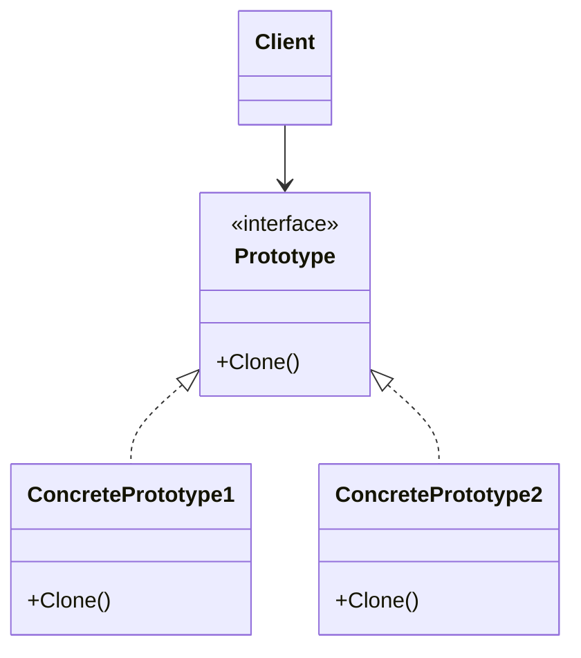
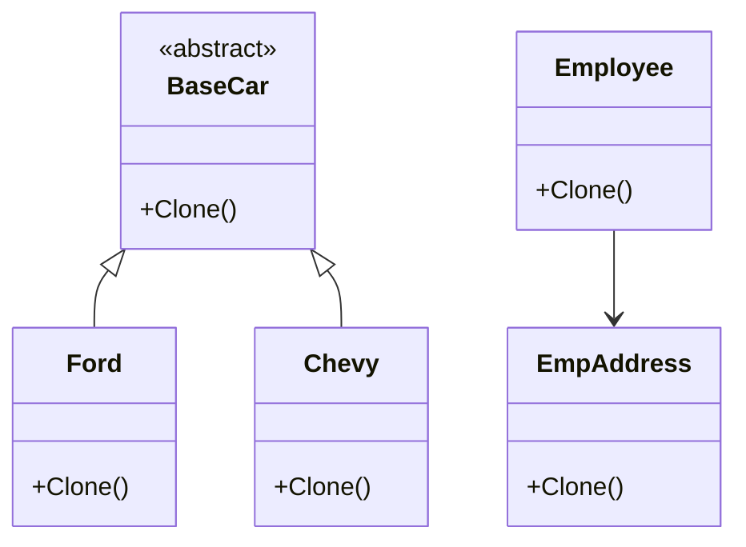

[English](#english) | [فارسی](#farsi)

# Prototype Design Pattern

The Prototype pattern is a creational design pattern that allows objects to be created by cloning an existing object. It promotes the creation of new objects by copying a prototypical instance, rather than by instantiating classes directly. This is particularly useful when the instantiation of an object is expensive or complex, or when you need to create many similar objects.

## Problem Solved

This pattern addresses the challenge of creating objects when:

*   The classes of objects to create are not known until runtime.
*   The classes to instantiate are determined by a prototypical instance, which may vary.
*   The cost of creating objects is high (e.g., involves complex initialization or resource loading).
*   You need to create many similar objects, and copying an existing one is more efficient than repeatedly calling a constructor.

## Solution

The Prototype pattern involves the following key participants:

1.  **Prototype (BaseCar, Employee, EmpAddress):** Declares an interface or abstract class for cloning itself. This typically includes a `Clone()` method.
2.  **Concrete Prototype (Ford, Chevy, Employee, EmpAddress):** Implements the cloning mechanism. This usually involves creating a new instance and copying the state of the current object to the new instance.
3.  **Client:** Creates new objects by requesting a clone from a prototype object. The client may work with either abstract prototype interfaces or concrete prototype classes.

## Implementation Details (C# Example)

This repository demonstrates the Prototype pattern in two main ways:

### Demonstration 1: Car Cloning

*   **`BaseCar` (Abstract Prototype):** An abstract class defining `ModelName`, `basePrice`, `onRoadPrice`, and an abstract `Clone()` method. It also includes a static helper `SetAdditionalPrice()` to simulate variable pricing.
*   **`Ford` and `Chevy` (Concrete Prototypes):** Inherit from `BaseCar` and implement the `Clone()` method using `MemberwiseClone()`. `MemberwiseClone()` creates a shallow copy.
*   **`CarFactory`:** Acts as a factory that holds prototype instances (`ford`, `chevy`) and provides methods (`GetFord`, `GetChevy`) to return clones of these prototypes. It uses lazy initialization and locking to ensure thread-safe creation of the first instance and subsequent cloning.

**Shallow Copy:** The `MemberwiseClone()` method performs a shallow copy. For value types (like `int`), their values are copied directly. For reference types (like `string` which is immutable, or a custom object reference), only the reference is copied. This means both the original and the clone might point to the *same* object in memory for reference types, which can lead to unintended side effects if one object modifies the referenced object.

### Demonstration 2: Employee Cloning (Shallow vs. Deep Copy)

*   **`EmpAddress`:** A simple class representing an address with a `Clone()` method that uses `MemberwiseClone()` (shallow copy for the `Address` string).
*   **`Employee`:** Contains `Id`, `Name`, and an `EmpAddress` object. It shows two ways to clone:
    *   A **clone constructor** (`public Employee(Employee emp)`): This demonstrates a **deep copy** approach by explicitly cloning the `Address` object using `emp.Address.Clone()`. This ensures the cloned employee has its own distinct address object.
    *   A `Clone()` method that performs a **shallow copy** using `MemberwiseClone()` and then manually deep-copies the `Address`.

**Deep Copy:** A deep copy creates a completely independent copy of the object, including any objects referenced by the original. Modifying the cloned object or its referenced objects does not affect the original.

## UML Structure

## Project Implementation UML

## When to Use

Use the Prototype pattern when:

*   You need to create objects whose class is determined by a prototypical instance.
*   It is more efficient to copy an existing object than to create a new one.
*   The objects to be created have a large number of fields or complex initialization logic.
*   You want to reduce the number of classes in your system by using object composition and delegation.

 
 

---

# الگوی طراحی Prototype (Prototype Design Pattern)

الگوی "Prototype" یک الگوی طراحی "سازنده" (Creational Design Pattern) است که به شما اجازه می‌دهد اشیاء را با کپی کردن (Cloning) از یک شیء موجود بسازید. این الگو به جای اینکه مستقیماً از کلاس‌ها نمونه‌سازی (Instantiate) کند، اشیاء جدید را با کپی گرفتن از یک "نمونه اولیه" (Prototypical Instance) ایجاد می‌کند. این روش به ویژه زمانی مفید است که ایجاد یک شیء هزینه سنگین یا پیچیدگی زیادی دارد، یا زمانی که نیاز دارید تعداد زیادی شیء مشابه بسازید.

## این الگو چه مشکلی را حل می‌کند؟

این الگو چالش ایجاد اشیاء را در شرایط زیر حل می‌کند:

*   کلاس‌های اشیایی که باید ساخته شوند تا زمان اجرا مشخص نیستند.
*   کلاس‌های مورد نیاز برای نمونه‌سازی توسط یک نمونه اولیه تعیین می‌شوند که ممکن است تغییر کند.
*   هزینه ایجاد اشیاء بالا است (مثلاً شامل مقداردهی اولیه پیچیده یا بارگذاری منابع است).
*   نیاز به ایجاد تعداد زیادی شیء مشابه دارید و کپی گرفتن از یک شیء موجود، کارآمدتر از فراخوانی مکرر سازنده (Constructor) است.

## راه حل این الگو چیست؟

الگوی Prototype شامل سه بخش اصلی است:

1.  **Prototype (نمونه اولیه - BaseCar, Employee, EmpAddress):** یک رابط یا کلاس انتزاعی برای "شبیه‌سازی" یا کپی کردن از خودش تعریف می‌کند. معمولاً شامل یک متد به نام `Clone()` است.
2.  **Concrete Prototype (نمونه اولیه بتنی - Ford, Chevy, Employee, EmpAddress):** مکانیسم کپی کردن را پیاده‌سازی می‌کند. این کار معمولاً شامل ایجاد یک نمونه جدید و کپی کردن حالت (State) شیء فعلی به نمونه جدید است.
3.  **Client:** اشیاء جدید را با درخواست یک نسخه کپی شده (Clone) از یک شیء نمونه اولیه ایجاد می‌کند. Client می‌تواند با رابط‌های نمونه اولیه انتزاعی یا کلاس‌های نمونه اولیه بتنی کار کند.

## جزئیات پیاده‌سازی (مثال C#)

این پروژه الگوی Prototype را به دو صورت اصلی نمایش می‌دهد:

### نمایش اول: کپی کردن ماشین‌ها

*   **`BaseCar` (نمونه اولیه انتزاعی):** یک کلاس انتزاعی که `ModelName` ، `basePrice` ، `onRoadPrice` و یک متد انتزاعی `Clone()` را تعریف می‌کند. همچنین شامل یک متد کمکی استاتیک `SetAdditionalPrice()` برای شبیه‌سازی قیمت‌گذاری متغیر است.
*   **`Ford` و `Chevy` (نمونه‌های اولیه بتنی):** از `BaseCar` ارث‌بری کرده و متد `Clone()` را با استفاده از `MemberwiseClone()` پیاده‌سازی می‌کنند. `MemberwiseClone()` یک کپی کم‌عمق (Shallow Copy) ایجاد می‌کند.
*   **`CarFactory`:** به عنوان یک کارخانه عمل می‌کند که نمونه‌های اولیه (`ford` ، `chevy`) را نگهداری می‌کند و متدهایی (`GetFord` ، `GetChevy`) برای برگرداندن کپی‌های این نمونه‌های اولیه ارائه می‌دهد.

**کپی کم‌عمق (Shallow Copy):** متد `MemberwiseClone()` یک کپی کم‌عمق انجام می‌دهد. برای انواع مقدار (Value Types مانند `int`)، مقادیر مستقیماً کپی می‌شوند. برای انواع مرجع (Reference Types مانند `string` که تغییرناپذیر است، یا یک مرجع به شیء سفارشی)، فقط مرجع کپی می‌شود. این بدان معناست که هم شیء اصلی و هم کپیِ آن ممکن است برای انواع مرجع به "همان" شیء در حافظه اشاره کنند، که اگر یکی از آن‌ها شیء ارجاع‌شده را تغییر دهد، می‌تواند عوارض ناخواسته‌ای داشته باشد.

### نمایش دوم: کپی کردن کارمند (کپی کم‌عمق در مقابل کپی عمیق)

*   **`EmpAddress`:** یک کلاس ساده که یک آدرس را نشان می‌دهد و متد `Clone()` آن از `MemberwiseClone()` استفاده می‌کند.
*   **`Employee`:** شامل `Id` ، `Name` و یک شیء `EmpAddress` است. دو روش برای کپی کردن را نشان می‌دهد:
    *   **سازنده کپی (Clone Constructor):** (`public Employee(Employee emp)`): این یک رویکرد **کپی عمیق (Deep Copy)** را نشان می‌دهد که در آن شیء `Address` با استفاده از `emp.Address.Clone()` به صراحت کپی می‌شود. این کار تضمین می‌کند که کارمند کپی شده، شیء آدرس خاص خودش را دارد.
    *   متد `Clone()` که یک **کپی کم‌عمق** با استفاده از `MemberwiseClone()` انجام می‌دهد و سپس `Address` را به صورت دستی کپی عمیق می‌کند.

**کپی عمیق (Deep Copy):** یک کپی عمیق، یک کپی کاملاً مستقل از شیء، از جمله هر شیئی که توسط اصلی ارجاع داده شده است، ایجاد می‌کند. تغییر در شیء کپی شده یا اشیاء ارجاعی آن، تاثیری بر اصلی ندارد.

## ساختار UML

## ساختار UML پیاده‌سازی پروژه

## چه زمانی باید از این الگو استفاده کنیم؟

هنگامی که از الگوی Prototype استفاده کنید:

*   نیاز به ایجاد اشیایی دارید که کلاس آن‌ها توسط یک نمونه اولیه تعیین می‌شود.
*   کپی کردن یک شیء موجود کارآمدتر از ایجاد یک شیء جدید است.
*   اشیاء مورد نیاز برای ایجاد دارای تعداد زیادی فیلد یا منطق مقداردهی اولیه پیچیده هستند.
*   می‌خواهید تعداد کلاس‌ها را در سیستم خود با استفاده از ترکیب اشیاء (Object Composition) و تفویض (Delegation) کاهش دهید.
