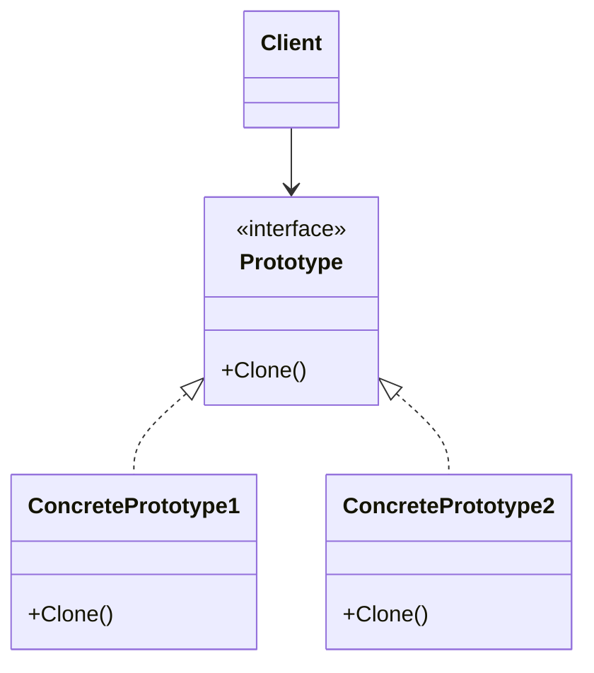
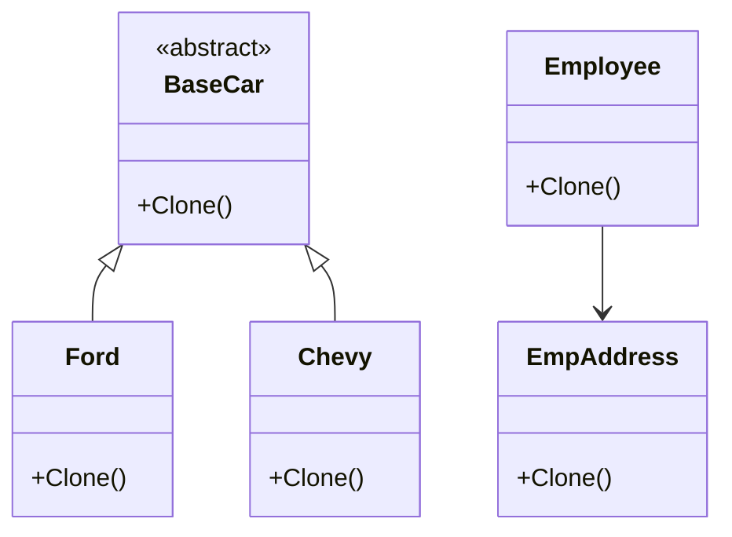

# Prototype Design Pattern

The Prototype pattern is a creational design pattern that allows objects to be created by cloning an existing object. It promotes the creation of new objects by copying a prototypical instance, rather than by instantiating classes directly. This is particularly useful when the instantiation of an object is expensive or complex, or when you need to create many similar objects.

## Problem Solved

This pattern addresses the challenge of creating objects when:

*   The classes of objects to create are not known until runtime.
*   The classes to instantiate are determined by a prototypical instance, which may vary.
*   The cost of creating objects is high (e.g., involves complex initialization or resource loading).
*   You need to create many similar objects, and copying an existing one is more efficient than repeatedly calling a constructor.

## Solution

The Prototype pattern involves the following key participants:

1.  **Prototype (BaseCar, Employee, EmpAddress):** Declares an interface or abstract class for cloning itself. This typically includes a `Clone()` method.
2.  **Concrete Prototype (Ford, Chevy, Employee, EmpAddress):** Implements the cloning mechanism. This usually involves creating a new instance and copying the state of the current object to the new instance.
3.  **Client:** Creates new objects by requesting a clone from a prototype object. The client may work with either abstract prototype interfaces or concrete prototype classes.

## Implementation Details (C# Example)

This repository demonstrates the Prototype pattern in two main ways:

### Demonstration 1: Car Cloning

*   **`BaseCar` (Abstract Prototype):** An abstract class defining `ModelName`, `basePrice`, `onRoadPrice`, and an abstract `Clone()` method. It also includes a static helper `SetAdditionalPrice()` to simulate variable pricing.
*   **`Ford` and `Chevy` (Concrete Prototypes):** Inherit from `BaseCar` and implement the `Clone()` method using `MemberwiseClone()`. `MemberwiseClone()` creates a shallow copy.
*   **`CarFactory`:** Acts as a factory that holds prototype instances (`ford`, `chevy`) and provides methods (`GetFord`, `GetChevy`) to return clones of these prototypes. It uses lazy initialization and locking to ensure thread-safe creation of the first instance and subsequent cloning.

**Shallow Copy:** The `MemberwiseClone()` method performs a shallow copy. For value types (like `int`), their values are copied directly. For reference types (like `string` which is immutable, or a custom object reference), only the reference is copied. This means both the original and the clone might point to the *same* object in memory for reference types, which can lead to unintended side effects if one object modifies the referenced object.

### Demonstration 2: Employee Cloning (Shallow vs. Deep Copy)

*   **`EmpAddress`:** A simple class representing an address with a `Clone()` method that uses `MemberwiseClone()` (shallow copy for the `Address` string).
*   **`Employee`:** Contains `Id`, `Name`, and an `EmpAddress` object. It shows two ways to clone:
    *   A **clone constructor** (`public Employee(Employee emp)`): This demonstrates a **deep copy** approach by explicitly cloning the `Address` object using `emp.Address.Clone()`. This ensures the cloned employee has its own distinct address object.
    *   A `Clone()` method that performs a **shallow copy** using `MemberwiseClone()` and then manually deep-copies the `Address`.

**Deep Copy:** A deep copy creates a completely independent copy of the object, including any objects referenced by the original. Modifying the cloned object or its referenced objects does not affect the original.

**Example Usage (from `Program.cs`):

```csharp
// Demonstration 1 (Car Cloning - commented out in example)
// var ford = factory.GetFord();
// var fordClone = ford.Clone();
// fordClone.onRoadPrice = fordClone.basePrice + BaseCar.SetAdditionalPrice();
// // Changes to fordClone.onRoadPrice do not affect ford (if BaseCar had no ref types)

// Demonstration 2 (Employee Cloning)
var empAddress = new EmpAddress("123 abc street");
var emp = new Employee(1, "someone", empAddress);

// Using clone constructor for deep copy
var clonedEmp = new Employee(emp);

// Modifying the original employee's address (via reference)
empAddress.Address = "CHANGED FOR CLONE!";

Console.WriteLine("[ORIGINAL]  " + emp);
Console.WriteLine("[CLONED]    " + clonedEmp);

// Output:
// [ORIGINAL]  Employee name is: someone, Employee Id is: 1, Employee Address is: CHANGED FOR CLONE!
// [CLONED]      Employee name is: someone, Employee Id is: 1, Employee Address is: 123 abc street
```

## UML Structure



## When to Use

Use the Prototype pattern when:

*   You need to create objects whose class is determined by a prototypical instance.
*   It is more efficient to copy an existing object than to create a new one.
*   The objects to be created have a large number of fields or complex initialization logic.
*   You want to reduce the number of classes in your system by using object composition and delegation.

## Project Implementation UML


