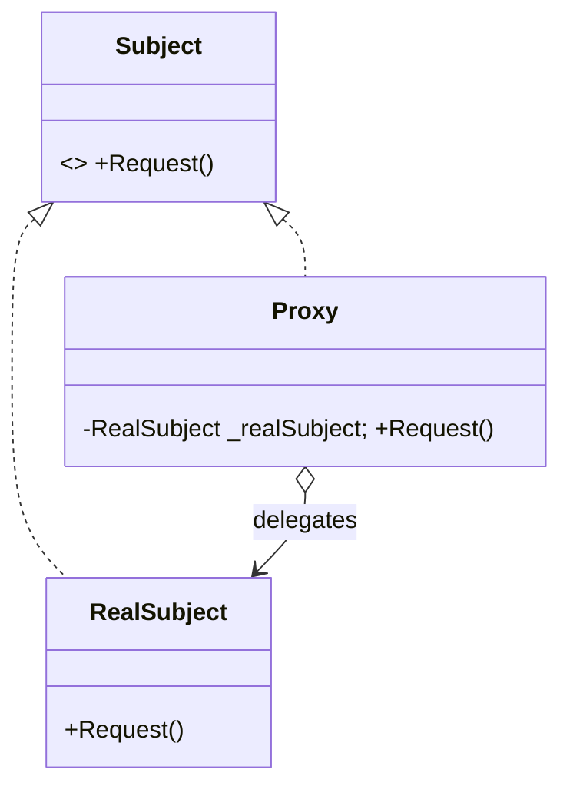
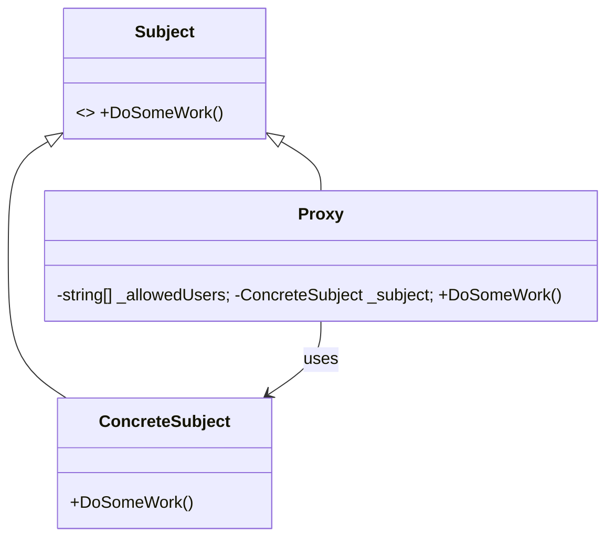
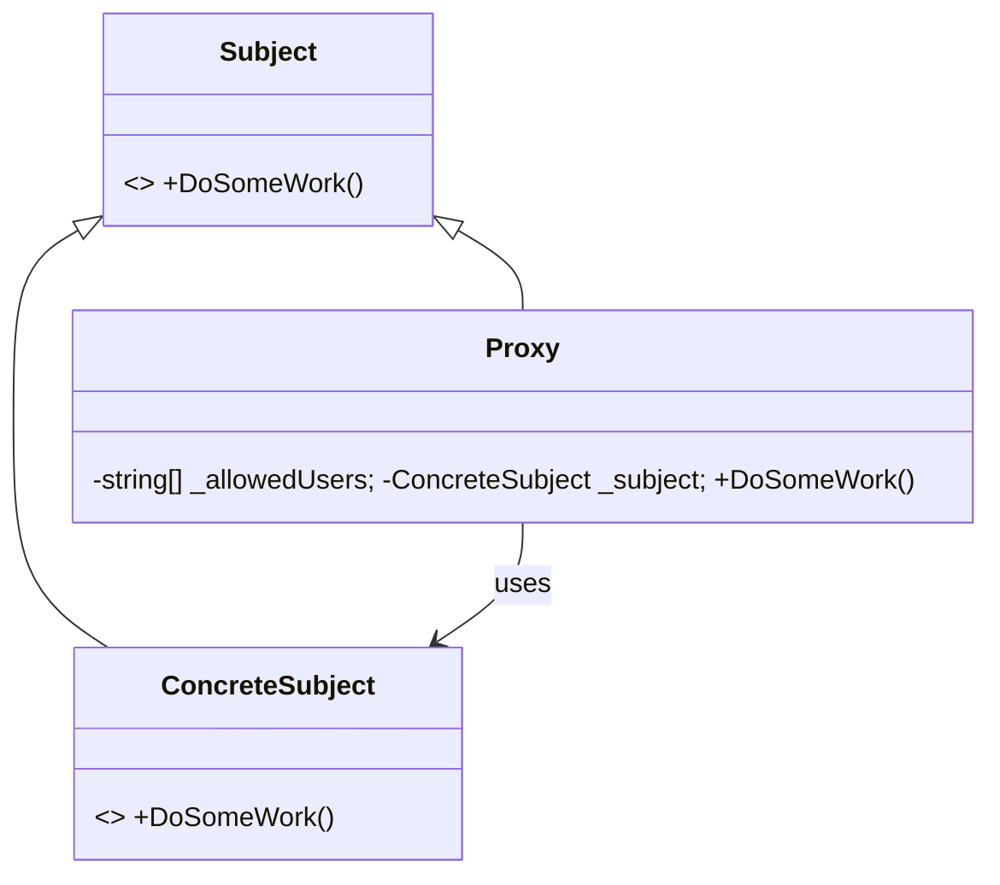

[English](#english) | [فارسی](#farsi)

# Proxy Design Pattern

The Proxy pattern is a structural design pattern that provides a surrogate or placeholder for another object. A proxy controls access to the original object, allowing you to perform something either before or after the request gets through to the original object.

## Problem Solved
When working with objects that are resource-intensive, remote, or require access control, direct interaction isn't always ideal. Proxy acts as a "middleman" that handles these complexities without the client ever knowing the difference.

## Common Proxy Types
1. **Virtual Proxy**: Delays the creation of a resource-heavy object until the first time a client requests it (Lazy Initialization).
2. **Protection Proxy**: Validates the caller's permissions before granting access to the real object.
3. **Remote Proxy**: Acts as a local representative for an object that lives in a different address space (e.g., a web service).
4. **Logging/Caching Proxy**: Records history or caches results to improve performance.

## UML Structure

## Project Implementation UML

---

# الگوی طراحی Proxy

الگوی "واسطه" (Proxy) یک الگوی ساختاری است که به عنوان یک جایگزین یا "نماینده" برای یک شیء دیگر عمل می‌کند. این واسطه، دسترسی به شیء اصلی را کنترل می‌کند و اجازه می‌دهد بدون تغییر کلاس اصلی، قابلیت‌ها یا محدودیت‌هایی به آن اضافه کنید.

## این الگو چه مشکلی را حل می‌کند؟
گاهی دسترسی مستقیم به یک شیء به دلیل هزینه‌بر بودن ساخت آن، دوریِ راه (در سیستم‌های توزیع‌شده) یا نیاز به کنترل امنیتی، درست نیست. Proxy مثل یک "نگهبان" یا "واسطه" عمل می‌کند و بین Client و شیء اصلی قرار می‌گیرد تا این پیچیدگی‌ها را مدیریت کند.

## انواع رایج واسطه (Proxy)
1. **Virtual Proxy**: اگر ساخت یک شیء خیلی سنگین است، آن را تا لحظه‌ای که واقعاً نیاز شود، نمی‌سازد (Lazy Initialization).
2. **Protection Proxy**: قبل از اجازه دادن به دسترسی، بررسی می‌کند که آیا کاربرِ فعلیِ برنامه مجوزِ این کار را دارد یا خیر.
3. **Remote Proxy**: نماینده شیئی است که در یک سرور یا پروسه دیگر قرار دارد (مثل کار با APIها).
4. **Logging/Caching Proxy**: بدون تغییر در کلاس اصلی، درخواست‌ها را لاگ می‌کند یا نتیجه عملیات را کش می‌کند تا سرعت بالا برود.

## ساختار UML

## ساختار UML پیاده‌سازی پروژه

