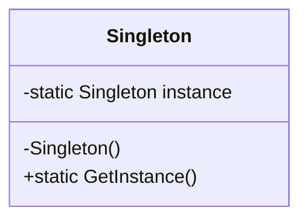
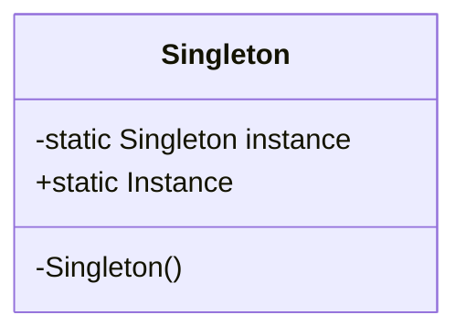

[English](#english) | [فارسی](#farsi)

<a name="english"></a>
# Singleton Design Pattern

The Singleton pattern is a creational design pattern that ensures a class only has one instance and provides a global point of access to it. It's used when exactly one object is needed to coordinate actions across the system.

## Problem Solved

This pattern addresses the need to have a single, globally accessible instance of a class. This is useful for:

*   Ensuring that only one instance of a class exists throughout the application's lifetime.
*   Providing a global access point to that single instance.
*   Controlling access to a shared resource (like a database connection pool, a configuration manager, or a logger).

## Solution

The Singleton pattern typically involves the following elements:

1.  **Private Constructor:** The class's constructor is made private to prevent external instantiation of the class.
2.  **Static Instance:** A static member variable within the class holds the single instance of the class.
3.  **Public Static Method:** A public static method (often named `GetInstance` or similar) provides the global access point to the single instance. This method typically checks if the instance has already been created; if so, it returns the existing instance; otherwise, it creates the instance, stores it in the static member, and then returns it.

## Implementation Details (C# Example)

In this C# implementation:

*   **`Singleton` Class:** This class represents the singleton object.
    *   It has a private constructor (`private Singleton()`).
    *   It has a static private field `_instance` to hold the single instance.
    *   It has a public static property `Instance` that returns the single instance. The first time `Instance` is accessed, it creates the `Singleton` object.
*   **`Program.cs` (Client):** Demonstrates how to access the singleton instance. Both `s1` and `s2` variables will refer to the exact same `Singleton` object, as shown by the output confirming their IDs are the same.

### Example Usage (`Program.cs`):

```csharp
// Accessing the singleton instance
var s1 = Singleton.Instance;
var s2 = Singleton.Instance;

// Checking if both variables refer to the same object
if (s1.Equals(s2))
    Console.WriteLine("Both s1 and s2 refer to the same Singleton object.");
else
    Console.WriteLine("Something went wrong! s1 and s2 are different objects.");

// You can call methods on the singleton instance
s1.SomeSingletonOperation(); // Example operation

Console.WriteLine($"Instance 1 ID: {s1.GetHashCode()}");
Console.WriteLine($"Instance 2 ID: {s2.GetHashCode()}");
```

**Thread Safety:** For multi-threaded environments, ensuring thread-safe instantiation is crucial. The provided example does not explicitly show thread-safe initialization (e.g., using `Lazy<T>` or double-checked locking), but in a production environment, this would be a necessary consideration.

## UML Structure



## When to Use

Use the Singleton pattern when:

*   There must be exactly one instance of a class, and it must be accessible from a well-known point.
*   The single instance should be extensible by subclassing, and clients should be able to use an extended instance without modifying their code.
*   You need a global variable but prefer a controlled, encapsulated access point.

**Caution:** Overuse of the Singleton pattern can lead to tightly coupled code and make unit testing more difficult, as it introduces global state. Consider alternatives like Dependency Injection when possible.

## Project Implementation UML



<br>
<br>

---

<a name="farsi"></a>
# الگوی طراحی تک‌نمونه (Singleton Design Pattern)

الگوی "تک‌نمونه" (Singleton) یکی از الگوهای طراحی "سازنده" (Creational Design Pattern) است که تضمین می‌کند یک کلاس فقط و فقط **یک نمونه (Instance)** دارد و یک نقطه دسترسی جهانی به آن فراهم می‌کند. این الگو زمانی استفاده می‌شود که دقیقاً به یک شیء نیاز دارید تا اقدامات را در کل سیستم هماهنگ کنید.

## این الگو چه مشکلی را حل می‌کند؟

این الگو به نیازِ داشتن یک نمونه واحد و در دسترسِ جهانی از یک کلاس پاسخ می‌دهد. این مورد برای کارهای زیر مفید است:

*   تضمین اینکه تنها یک نمونه از یک کلاس در طول عمر برنامه وجود داشته باشد.
*   فراهم کردن یک نقطه دسترسی جهانی به آن نمونه واحد.
*   کنترل دسترسی به منابع مشترک (مانند اتصال به بانک اطلاعاتی، مدیر تنظیمات، یا لاگر - Logger).

## راه حل این الگو چیست؟

الگوی تک‌نمونه معمولاً شامل موارد زیر است:

1.  **سازنده خصوصی (Private Constructor):** سازنده کلاس را خصوصی می‌کنیم تا از ایجاد نمونه‌های جدید از بیرون کلاس جلوگیری شود.
2.  **نمونه استاتیک (Static Instance):** یک متغیر عضو استاتیک در داخل کلاس، نمونه واحد کلاس را نگه می‌دارد.
3.  **متد استاتیک عمومی (Public Static Method):** یک متد استاتیک عمومی (که اغلب `GetInstance` یا مشابه نامیده می‌شود) نقطه دسترسی جهانی را به نمونه واحد فراهم می‌کند. این متد معمولاً بررسی می‌کند که آیا نمونه قبلاً ایجاد شده است یا خیر؛ اگر شده باشد، نمونه موجود را برمی‌گرداند؛ در غیر این صورت، نمونه را ایجاد می‌کند، آن را در عضو استاتیک ذخیره می‌کند و سپس برمی‌گرداند.

## جزئیات پیاده‌سازی (مثال C#)

در این پیاده‌سازی C#:

*   **کلاس `Singleton`:** این کلاس نشان‌دهنده شیء تک‌نمونه است.
    *   دارای یک سازنده خصوصی (`private Singleton()`) است.
    *   دارای یک فیلد خصوصی استاتیک `_instance` برای نگهداری نمونه واحد است.
    *   دارای یک ویژگی (Property) استاتیک عمومی `Instance` است که نمونه واحد را برمی‌گرداند. اولین باری که `Instance` فراخوانی شود، شیء `Singleton` ساخته می‌شود.
*   **`Program.cs` (استفاده‌کننده):** نشان می‌دهد که چگونه به نمونه تک‌نمونه دسترسی پیدا کنیم. متغیرهای `s1` و `s2` هر دو به دقیقاً همان شیء `Singleton` اشاره می‌کنند.

### نمونه استفاده

```csharp
// دسترسی به نمونه تک‌نمونه
var s1 = Singleton.Instance;
var s2 = Singleton.Instance;

// بررسی اینکه آیا هر دو متغیر به یک شیء اشاره می‌کنند
if (s1.Equals(s2))
    Console.WriteLine("Both s1 and s2 refer to the same Singleton object.");
else
    Console.WriteLine("Something went wrong!");

// فراخوانی متدها روی نمونه تک‌نمونه
s1.SomeSingletonOperation(); 

Console.WriteLine($"Instance 1 ID: {s1.GetHashCode()}");
Console.WriteLine($"Instance 2 ID: {s2.GetHashCode()}");
```

**امنیت در محیط‌های چندنخی (Thread Safety):** برای محیط‌های چندنخی، اطمینان از ساختِ ایمن (Thread-safe) نمونه بسیار مهم است. مثال ارائه شده به صورت صریح نشان‌دهنده مقداردهی ایمن نیست (مثلاً استفاده از `Lazy<T>` یا الگوی Double-checked locking)، اما در یک محیط عملیاتی (Production)، این موضوع باید در نظر گرفته شود.

## ساختار UML


## چه زمانی باید از این الگو استفاده کنیم؟

هنگامی که از الگوی تک‌نمونه استفاده کنید:

*   باید دقیقاً یک نمونه از یک کلاس وجود داشته باشد و باید از یک نقطه مشخص در دسترس باشد.
*   نمونه واحد باید با استفاده از ارث‌بری (Subclassing) قابل گسترش باشد و استفاده‌کنندگان بتوانند از یک نمونه گسترش‌یافته بدون تغییر کدشان استفاده کنند.
*   نیاز به یک متغیر جهانی دارید اما ترجیح می‌دهید یک نقطه دسترسی کنترل‌شده و کپسوله‌شده داشته باشید.

**هشدار:** استفاده بیش از حد از الگوی تک‌نمونه می‌تواند منجر به کدی با وابستگی شدید (Tightly Coupled) شود و تست کردن واحد (Unit Testing) را دشوارتر کند، زیرا وضعیت جهانی (Global State) را معرفی می‌کند. در صورت امکان، به جای آن استفاده از Dependency Injection را در نظر بگیرید.

## ساختار UML پیاده‌سازی پروژه


