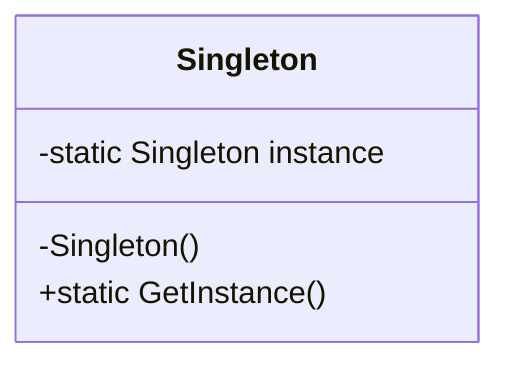
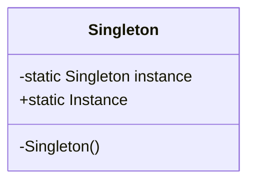

# Singleton Design Pattern

The Singleton pattern is a creational design pattern that ensures a class only has one instance and provides a global point of access to it. It's used when exactly one object is needed to coordinate actions across the system.

## Problem Solved

This pattern addresses the need to have a single, globally accessible instance of a class. This is useful for:

*   Ensuring that only one instance of a class exists throughout the application's lifetime.
*   Providing a global access point to that single instance.
*   Controlling access to a shared resource (like a database connection pool, a configuration manager, or a logger).

## Solution

The Singleton pattern typically involves the following elements:

1.  **Private Constructor:** The class's constructor is made private to prevent external instantiation of the class.
2.  **Static Instance:** A static member variable within the class holds the single instance of the class.
3.  **Public Static Method:** A public static method (often named `GetInstance` or similar) provides the global access point to the single instance. This method typically checks if the instance has already been created; if so, it returns the existing instance; otherwise, it creates the instance, stores it in the static member, and then returns it.

## Implementation Details (C# Example)

In this C# implementation:

*   **`Singleton` Class:** This class represents the singleton object.
    *   It has a private constructor (`private Singleton()`).
    *   It has a static private field `_instance` to hold the single instance.
    *   It has a public static property `Instance` that returns the single instance. The first time `Instance` is accessed, it creates the `Singleton` object.
*   **`Program.cs` (Client):** Demonstrates how to access the singleton instance. Both `s1` and `s2` variables will refer to the exact same `Singleton` object, as shown by the output confirming their IDs are the same.

### Example Usage (`Program.cs`):

```csharp
// Accessing the singleton instance
var s1 = Singleton.Instance;
var s2 = Singleton.Instance;

// Checking if both variables refer to the same object
if (s1.Equals(s2))
    Console.WriteLine("Both s1 and s2 refer to the same Singleton object.");
else
    Console.WriteLine("Something went wrong! s1 and s2 are different objects.");

// You can call methods on the singleton instance
s1.SomeSingletonOperation(); // Example operation

Console.WriteLine($"Instance 1 ID: {s1.GetHashCode()}");
Console.WriteLine($"Instance 2 ID: {s2.GetHashCode()}");
```

**Thread Safety:** For multi-threaded environments, ensuring thread-safe instantiation is crucial. The provided example does not explicitly show thread-safe initialization (e.g., using `Lazy<T>` or double-checked locking), but in a production environment, this would be a necessary consideration.

## UML Structure



## When to Use

Use the Singleton pattern when:

*   There must be exactly one instance of a class, and it must be accessible from a well-known point.
*   The single instance should be extensible by subclassing, and clients should be able to use an extended instance without modifying their code.
*   You need a global variable but prefer a controlled, encapsulated access point.

**Caution:** Overuse of the Singleton pattern can lead to tightly coupled code and make unit testing more difficult, as it introduces global state. Consider alternatives like Dependency Injection when possible.

## Project Implementation UML


